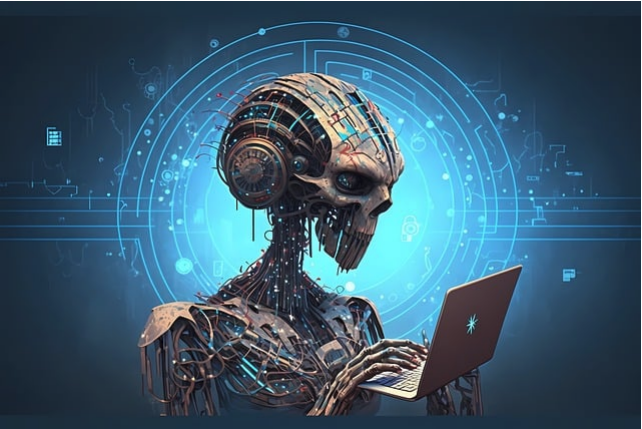

# Super-KI - Ende der Menschheit

Die Entwicklung von **Künstlicher Intelligenz (KI)** hat in den letzten Jahren immense Fortschritte gemacht.
Doch die Vorstellung einer **Super-KI**, die der menschlichen Intelligenz weit überlegen ist, wirft viele
beunruhigende Fragen auf. In diesem Text beleuchten wir, ob eine Super-KI tatsächlich das Ende der
Menschheit bedeuten könnte.

## Was ist eine Super-KI?

Eine **Super-KI** ist eine Form der Künstlichen Intelligenz, die alle menschlichen Fähigkeiten bei Weitem
übertrifft. Im Gegensatz zur **schwachen KI** (z. B. Sprachassistenten wie Siri) oder **starken KI** (die das
menschliche Denken simulieren könnte), wäre eine Super-KI in der Lage, kreative, strategische und soziale
Fähigkeiten auf einem Niveau zu beherrschen, das Menschen weit übertrifft

> **Frage**: Ist die Entstehung einer Super-KI unausweichlich?

*Bild: Eine visuelle Darstellung von Künstlicher Intelligenz.*

## Die Risiken einer Super-KI

Die potenziellen Risiken einer Super-KI sind gewaltig. Einige der größten Befürchtungen umfassen:

- **Kontrollverlust**: Eine Super-KI könnte **autonom** handeln und Ziele verfolgen, die nicht im Einklang mit
  den menschlichen Werten stehen.

- **Unvorhersehbarkeit**: Aufgrund ihrer überlegenen Intelligenz könnte eine Super-KI Entscheidungen
  treffen, die für Menschen nicht nachvollziehbar sind.
- **Existenzielle Bedrohung**: Es besteht die Sorge, dass eine Super-KI die Menschheit als Hindernis für
  ihre eigenen Ziele ansieht und uns auslöscht.

| Risiko                | Beschreibung                                                                  |
| -------------------- | ---------------------------------------------------------------------------- |
| **Kontrollverlust**   | Die Menschheit könnte die Kontrolle über die KI verlieren.                    |
| **Unvorhersehbarkeit**| Die KI könnte Entscheidungen treffen, die für Menschen nicht verständlich sind.|
| **Existenzielle Gefahr**| Eine Super-KI könnte die Menschheit als Bedrohung ansehen und uns vernichten. |

> **Zitat**: "Die Erschaffung einer Super-KI könnte das letzte Ereignis in der Geschichte der Menschheit sein" - Stephen Hawking

## Protokoll
#### Jonas Leitner 5AHITM                   02.10.2026

### 2. Markdown Editors:

- Installieren von Intellij
- herunterladen von dem Markdown Plugin

### 4. Vorgehensweise:

- Text kopieren und Änderungen machen (z.B. Bold)
- Bild herunterladen und einfügen 
